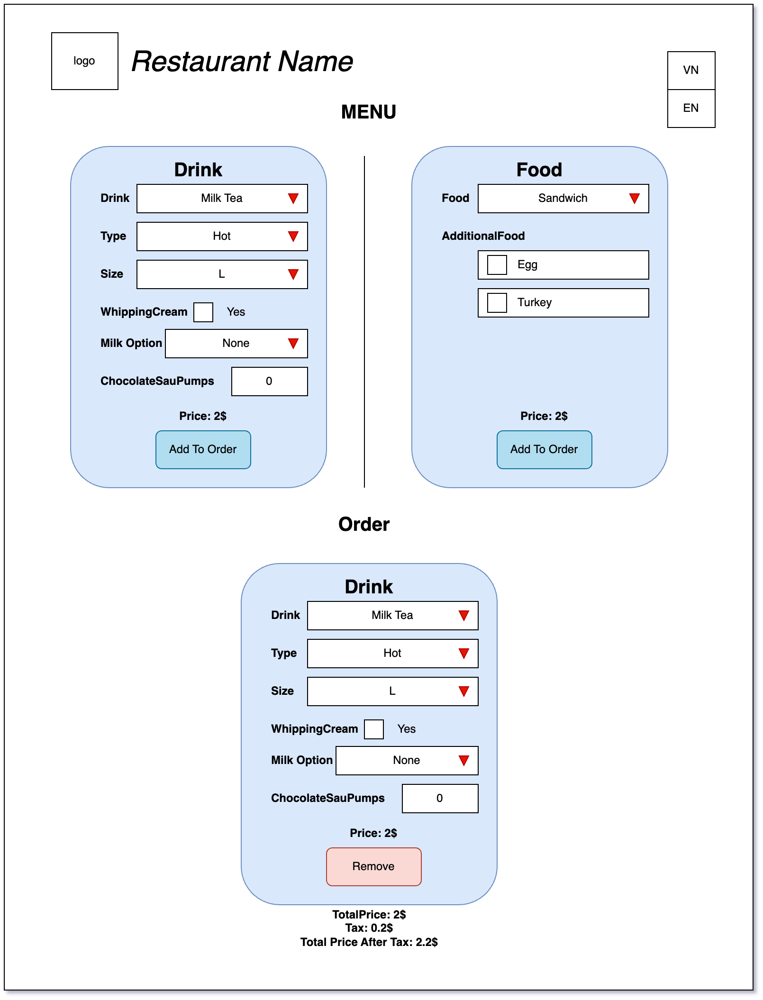

## Code Documentation

The Application for a menu system that allows users to select and customize drinks and food items. It includes features such as selecting drink type, size, milk options, adding additional ingredients, and calculating the total price of the order.

### Mockup



### Demo

http://duongphan.com:3000/

### Components

#### `Drink`

The `Drink` component is a React class component that represents a drink item in the menu. It includes form inputs for selecting drink options such as drink type, size, milk option, and chocolate sauce pumps.

##### Props

- `onChange`: A callback function that is triggered when the selected drink item is updated. It receives the updated item details and price.

##### State

- `type`: Represents the selected drink type.
- `size`: Represents the selected drink size.
- `milkOption`: Represents the selected milk option.
- `whippedCream`: Represents whether whipped cream is included (true/false).
- `chocolatePumps`: Represents the number of chocolate sauce pumps selected.
- `price`: Represents the calculated price based on the selected options.

##### Methods

- `handleTypeChange(event)`: Updates the state with the selected drink type.
- `handleSizeChange(event)`: Updates the state with the selected drink size.
- `handleMilkOptionChange(event)`: Updates the state with the selected milk option.
- `handleWhippedCreamChange(event)`: Updates the state with the whipped cream selection.
- `handleChocolatePumpsChange(event)`: Updates the state with the selected number of chocolate sauce pumps.
- `calculatePrice()`: Calculates the price of the drink based on the selected options.
- `handleChange()`: Calls the `onChange` prop function with the updated drink details and price.

#### `Food`

The `Food` component is a React class component that represents a food item in the menu. It includes form inputs for selecting a food item and additional ingredients.

##### Props

- `onChange`: A callback function that is triggered when the selected food item is updated. It receives the updated item details and price.

##### State

- `foodItem`: Represents the selected food item.
- `ingredients`: Represents the selected additional ingredients.
- `price`: Represents the calculated price based on the selected options.

##### Methods

- `handleFoodItemChange(event)`: Updates the state with the selected food item.
- `handleIngredientChange(event)`: Updates the state with the selected additional ingredients.
- `calculatePrice()`: Calculates the price of the food item based on the selected options.
- `handleChange()`: Calls the `onChange` prop function with the updated food details and price.

#### `Menu`

The `Menu` component is a React class component that serves as the main container for the menu system. It manages the state of the selected drink, food, order items, and order prices.

##### State

- `drink`: Represents the currently selected drink item, including its options and price.
- `food`: Represents the currently selected food item, including its options and price.
- `order`: An array of objects representing the items in the order. Each object contains the details of the item, including its type (drink or food), options, and price.
- `orderPrice`: An object that holds the total order price, tax amount, and total order price after tax.

##### Methods

- `handleDrinkChange(item)`: Updates the state with the selected drink item details and price.
- `handleFoodChange(item)`: Updates the state with the selected food item details and price.
- `handleAddToOrder()`: Adds the selected drink or food item to the order.
- `handleRemoveFromOrder(index)`: Removes the item at the specified index from the order.
- `calculateOrderPrice()`: Calculates the total order

### Functionality

#### Drink Selection and Customization

The `Drink` component allows users to select the drink type, size, milk option, whether to include whipping cream, and the number of chocolate sauce pumps. The component calculates the price based on the selected options and updates the state accordingly. It also triggers the `onChange` function to communicate the updated drink details and price to the `Menu` component.

#### Food Selection and Customization

The `Food` component allows users to select a food item and add additional ingredients. The component calculates the price based on the selected options and updates the state accordingly. It also triggers the `onChange` function to communicate the updated food details and price to the `Menu` component.

#### Order Management

The `Menu` component manages the order items and provides functionality to add new drink or food items to the order. It updates the state with the new order items and triggers the calculation of the total order price. Users can also remove items from the order by clicking the "Remove" button associated with each order item. The `Menu` component keeps track of the total order price, tax amount, and total order price after tax.

### Error Handling

Includes basic error handling to validate user inputs and display appropriate error messages when invalid options or configurations are selected. Error messages are displayed using `alert()` function calls.

### User Interface

Includes a basic user interface created using Bootstrap CSS classes and form elements. The `Menu` component renders the drink and food selection forms side by side. The selected items are

## Multiple Language Support Documentation

### Language Files

The `Menu` component uses separate language files to store translations for different languages. These language files contain key-value pairs where the keys represent unique identifiers and the values represent the translated text.

For example:

- `en.json` (English translation file):

```json
{
  "menu.title": "Menu",
  "menu.addOrder": "Add to Order",
  "order.title": "Order",
  "order.clear": "Clear Order",
  "order.price": "Order Price",
  "order.tax": "Tax",
  "order.priceAfterTax": "Order Price After Tax",
  "order.empty": "No items in order."
}
```

- `vn.json` (Vietnamese translation file):

```json
{
  "menu.title": "Thực Đơn",
  "menu.addOrder": "Thêm vào đơn hàng",
  "order.title": "Đơn hàng",
  "order.clear": "Xóa Đơn hàng",
  "order.price": "Giá đơn hàng",
  "order.tax": "Thuế",
  "order.priceAfterTax": "Giá đơn hàng sau thuế",
  "order.empty": "Không có sản phẩm trong đơn hàng."
}
```

### Locale Management

The `Menu` component includes a `locale` state variable that represents the currently selected language. By default, it is initialized to a specific language, such as `"en"` for English.

### Language Selection

A language selection feature is implemented in the `Menu` component. It allows users to switch between different languages. This feature typically involves a dropdown menu or a set of buttons that enable language selection.

When the user selects a different language, the `locale` state variable is updated accordingly. The component then re-renders, and the content is displayed in the selected language.

### IntlProvider

The `IntlProvider` component from the React Intl library is used to wrap the content of the `Menu` component. It provides the necessary context for language translation.

The `IntlProvider` component requires two props:

- `locale`: Represents the currently selected language.
- `messages`: An object that contains the translations for the selected language.

The `messages` prop is obtained by importing the appropriate language file based on the `locale` value. This ensures that the correct translations are used when rendering the component.

### Translating Text

To display translated text, the `FormattedMessage` component from the React Intl library is used. It is a higher-level component that takes care of the translation based on the provided `id` and `defaultMessage` props.

The `id` prop corresponds to the translation key in the language file. The `defaultMessage` prop serves as a fallback if the translation for the specified key is not available.

For example:

```jsx
<FormattedMessage id="menu.title" defaultMessage="Menu" />
```

In this case, the translation key `"menu.title"` is used, and if a translation for that key is not available, the fallback message `"Menu"` will be displayed.

### Updating Translations

When the user selects a different language, the `locale` state variable is updated, triggering a re-render of the `Menu` component. The `IntlProvider` component then provides the updated translations based on the new `locale` value.

The `FormattedMessage` components in the component's JSX will automatically update their rendered text based on the selected language.
