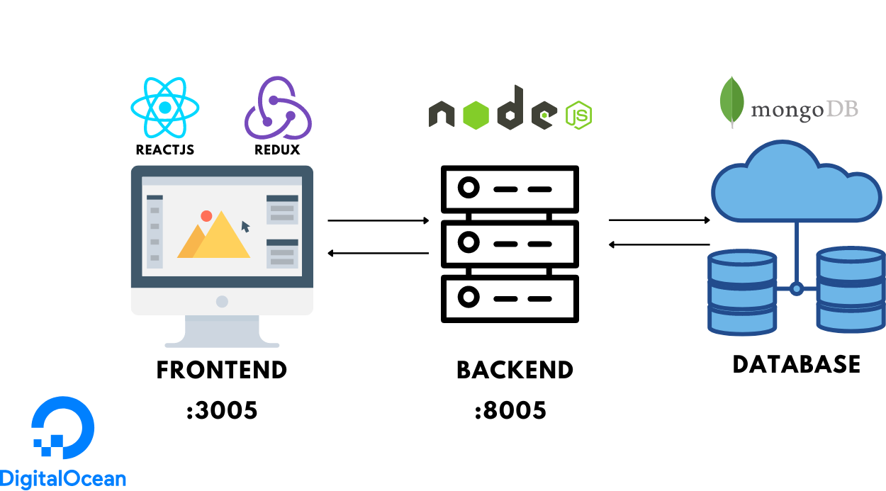

# Coffee Shop Repo

You can try our application at: [https://restaurant.duongphan.com/](https://restaurant.duongphan.com/)

This repository contains two sub-repositories for a coffee shop project.

## Application Flow

## Pricing Frontend (1.2.pricing_UI/pricing)

This sub-repository contains the frontend code for the pricing module.

**Frontend Tech Stack:**

- ReactJS
- Redux

### Running the Frontend

To run the frontend, follow these steps:

1. Make sure your machine has npm installed.
2. Run `npm install` to install the required packages.
3. Create a `.env` file, following the structure of the `.env.example` file, to load the environment variables required for the application.
4. Run `npm start` to start the ReactJS application. It will be accessible on PORT 3000.

## Pricing Backend (1.3.pricing_be)

This sub-repository contains the backend code for the pricing module.

**Backend Tech Stack:**

- Node.js
- MongoDB

### Running the Backend (Optional)

1. You can use my setup backend expose API by setting `.env` in the frontend folder `REACT_APP_BACKEND_URL=https://restaurant.duongphan.com/api`. This way, you can use my backend provided API directly and do not need to set up the backend on your local machine.

2. To run the backend on your local machine:

   1. Run `npm install` to install the required packages.
   2. Create a `.env` file, following the structure of the `.env.example` file, to load the environment variables required for the application.
   3. Change the value of `DB_NAME` in the `.env` file to use your own testing database name.
   4. Run `nodemon start` to start the Node.js application. It will be accessible on PORT 8005.
